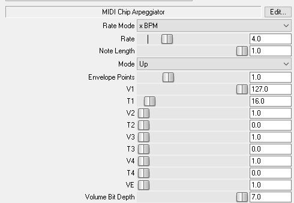

# ChipArp
A ReaJS script that generates midi messages for chiptune-style arps, using note velocity to generate a volume envelope.

Envelopes are generated as a series of 0-4 points, each starting at a Velocity V and interpolating to the next point based on a Time T

